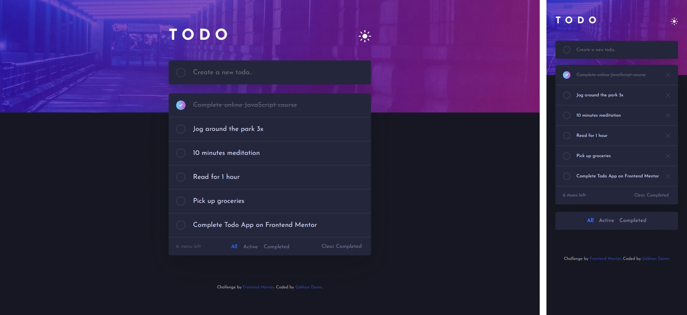

## Todo App

Selamlar, ben bu projede frontendmentor.io sitesinde yer alan [_"Todo App"_](https://www.frontendmentor.io/challenges/todo-app-Su1_KokOW) projesini geliştirdim. Projede kullandığım diller: HTML, CSS, JavaScript.

Demo: https://frontendmentor-challenge-todo-app-pearl.vercel.app/ 

---

### Bu Projede Yaptıklarım:

- İstenilen tasarımı bilgisayar, telefon ve tablet gibi tüm cihazlarda kullanıma uygun olacak şekilde yerine getirdim.
- Tasarımın "Pixel Perfect" olmasına özen gösterdim.
- Listede bulunan görevlere "tamamlandı" ve "sil" fonksiyonları ekledim.
- Görevlerin tümünü, tamamlanmış olanları ve aktif olanları gösterecek şekilde filtereledim.
- Tamamlanmış olan görevlerin tümünün silinmesini sağlayan buton ekledim.
- Açık ve koyu tema seçenekleri ekledim.
- Görevleri localStorage tarafında tutulmasını sağladım.

---

### İletişim

_gkhandemir96@gmail.com_
